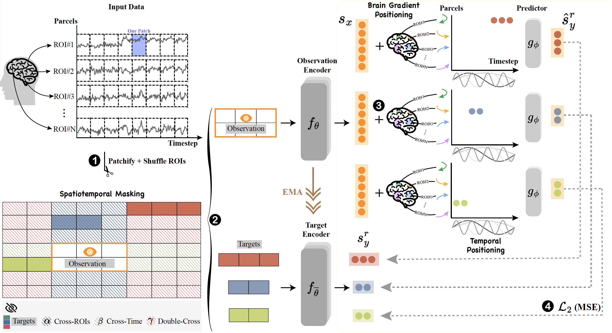
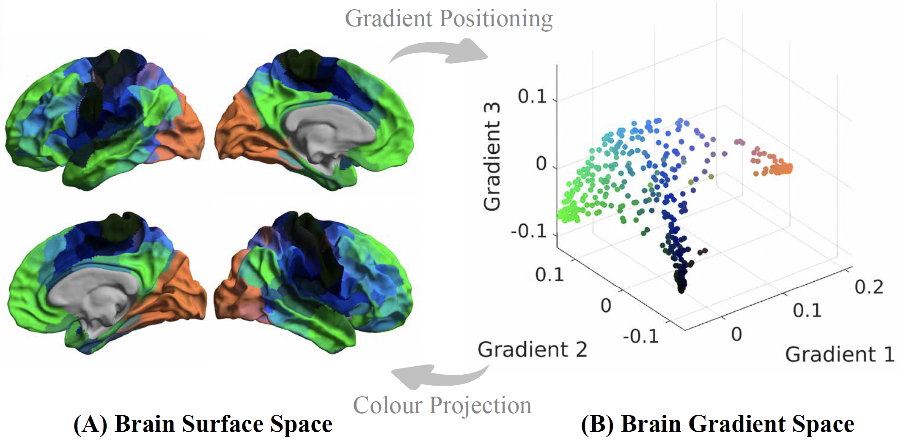

# Brain-JEPA

Official Repository of the paper: [Brain-JEPA: Brain Dynamics Foundation Model with Gradient Positioning and Spatiotemporal Masking](http://arxiv.org/abs/2409.19407) (*NeurIPS 2024, Spotlight*)
<!-- <br>
__Brain-JEPA: Brain Dynamics Foundation Model with Gradient Positioning and Spatiotemporal Masking__ <br>
The Thirty-eighth Annual Conference on Neural Information Processing Systems (NeurIPS 2024), __Spotlight__ -->

## Method
<p align="center">
  
</p>

<div align="center">

<b>Schematic overview of Brain-JEPA</b>.

</div>

Brain-JEPA has three main contributions:
1. **_Brain gradient positioning_** for ROI locations, and sine and cosine functions for temporal positioning. <br>
2. **_Spatiotemporal masking_**: Brain-JEPA employs a single observation block to predict the representations of target blocks sampled from three distinct regions: Cross-ROI, Cross-Time, and Double-Cross. <br>
3. The use of **_JEPA_** architecture. 

<p align="center">
  
</p>

<div align="center">

<b>Brain gradient positioning</b>. Brain cortical regions are situated in the top 3 gradient axes and colored based on their positions. These colors are then projected back into the brain surface.

</div>

## Dataset
Three publicly available datasets were used in this paper: [UKB](https://www.ukbiobank.ac.uk/), [HCP-Aging](https://www.humanconnectome.org/study/hcp-lifespan-aging), and [ADNI](https://adni.loni.usc.edu/).<br>
The in-house dataset for NC/MCI classification is from  [Memory, Ageing and Cognition Centre (MACC)](https://medicine.nus.edu.sg/macc/).

UKB dataset is directly downloaded from [Mansour _et al._](https://www.sciencedirect.com/science/article/pii/S105381192300558X).

We followed the preprocessing pipelines in [Wu _et al._](https://www.sciencedirect.com/science/article/pii/S105381192200684X?via%3Dihub) and [Kong _et al._](https://academic.oup.com/cercor/article/29/6/2533/5033556?login=false) for HCP-Aging and ADNI, respectively.

Population-level brain gradient was derived from UKB data with [Brainspace toolbox](https://brainspace.readthedocs.io/en/latest/).

## Code Structure

```
.
├── configs                   #   directory in which all experiment '.yaml' configs are stored
├── downstream_tasks          #   the downstream package
│   ├── utils                 #   shared downstream utilities 
│   ├── engine_finetune.py    #   train_one_epoch and evaluation
│   ├── main_finetune.py      #   fine-tuning training loop
│   ├── main_linearprobe.py   #   linear-probing training loop
│   ├── models_vit.py         #   model for downstream tasks
├── data                      #   put dataset and gradient file here
├── logs                      #   put the downloaded pre-trained checkpoints here
├── output_dirs               #   put the downloaded example downstream checkpoints here
├── src                       #   the package
│   ├── helper.py             #   helper functions for init of models 
│   ├── train.py              #   pretraining
│   ├── datasets              #   datasets, data loaders, ...
│   ├── models                #   model definitions
│   ├── masks                 #   mask collators, masking utilities, ...
│   └── utils                 #   shared utilities
├── downstream_eval.py        #   entrypoint for launch downstream tasks\
```

## Checkpoints
Checkpoints of the pre-trained model, and example fine-tuned model, can be downloaded from [here](https://drive.google.com/drive/folders/1zoe5zjWkj2KY824XWTukrXxrMno2mlN5?usp=sharing).

## Launching Brain-JEPA pretraining

### Environment
```
conda create -n brain-jepa python=3.8
pip install -r requirement.txt
```

### Multi-GPU training
This implementation starts from the [main.py](main.py), which parses the experiment config file and runs the pre-training locally on a multi-GPU (or single-GPU) machine. For example, to run Brain-JEPA pretraining on GPUs "0","1", "2" and "3" on a local machine using the config [configs/ukb_vitb_ep300.yaml](configs/ukb_vitb_ep300.yaml), type the command:
```
python main.py \
  --fname configs/ukb_vitb_ep300.yaml \
  --devices cuda:0 cuda:1 cuda:2 cuda:3
```

*Note: Our pretraining was performed on 4 A100 (40G) GPUs.*

## Evaluations
Example:

```
sh scripts/classification/run_downstream_FT_hca_sex.sh
```

**Config files:**
Note that all experiment parameters are specified in config files (as opposed to command-line-arguments). See the [configs/](configs/) directory for example config files.


---

## TODO

- [ ] Release code for representation conditional fMRI signal reconstruction


## Acknowledgement
Our codebase builds heavily on [I-JEPA](https://github.com/facebookresearch/ijepa) and [MAE](https://github.com/facebookresearch/mae).

Thanks for the opensourcing!

## Citation
If you find this repository useful in your research, please consider giving a star :star: and a citation
```
@article{BrainJEPA,
  title={Brain-JEPA: Brain Dynamics Foundation Model with Gradient Positioning and Spatiotemporal Masking},
  author={Zijian Dong and Ruilin Li and Yilei Wu and Thuan Tinh Nguyen and Joanna Su Xian Chong and Fang Ji and Nathanael Ren Jie Tong and Christopher Li Hsian Chen and Juan Helen Zhou},
  journal={NeurIPS 2024},
  year={2024}
}
